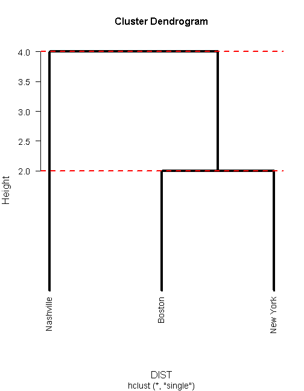
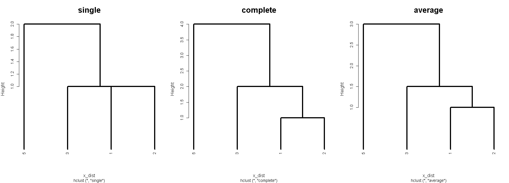
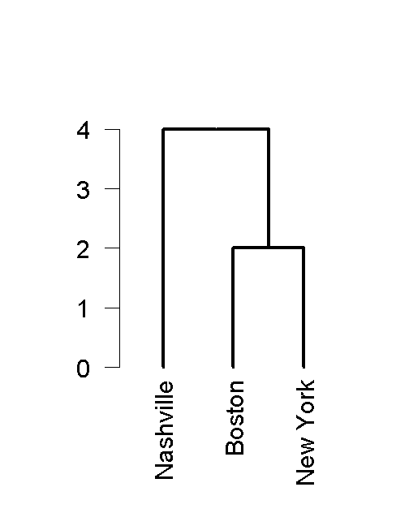
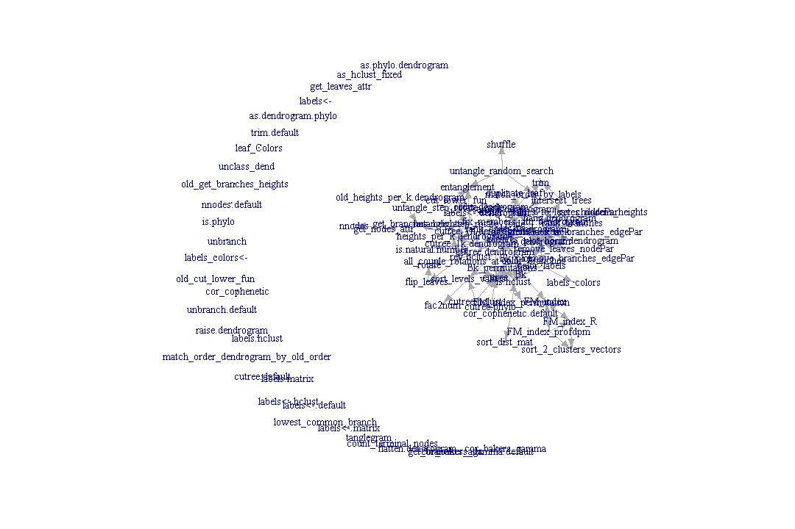
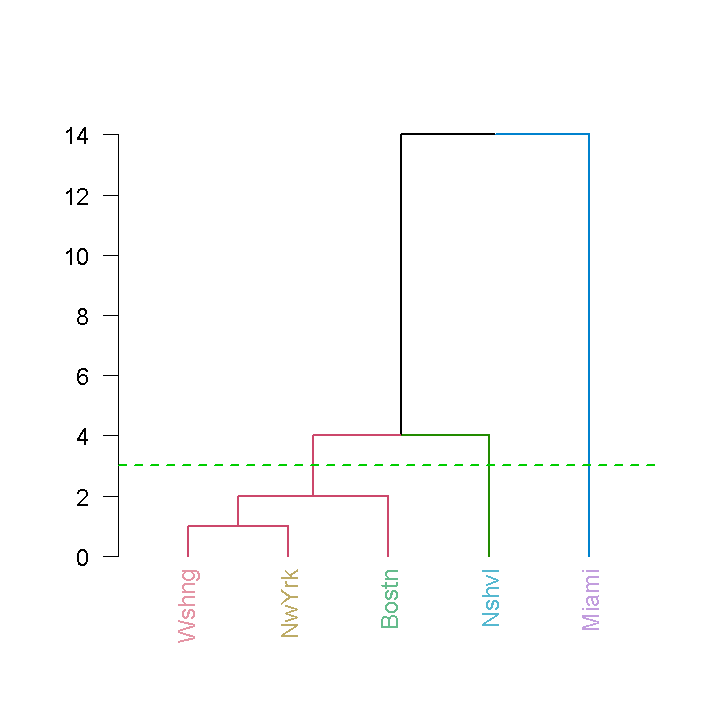
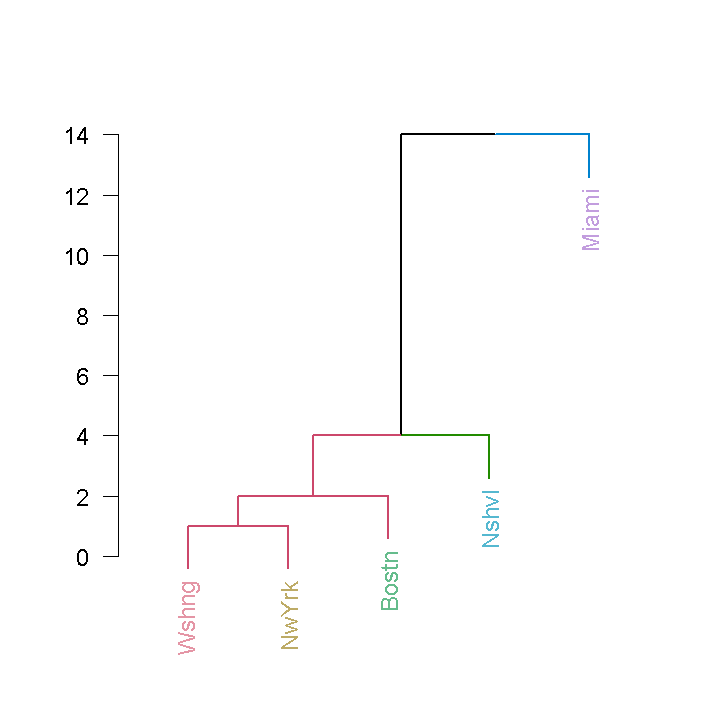
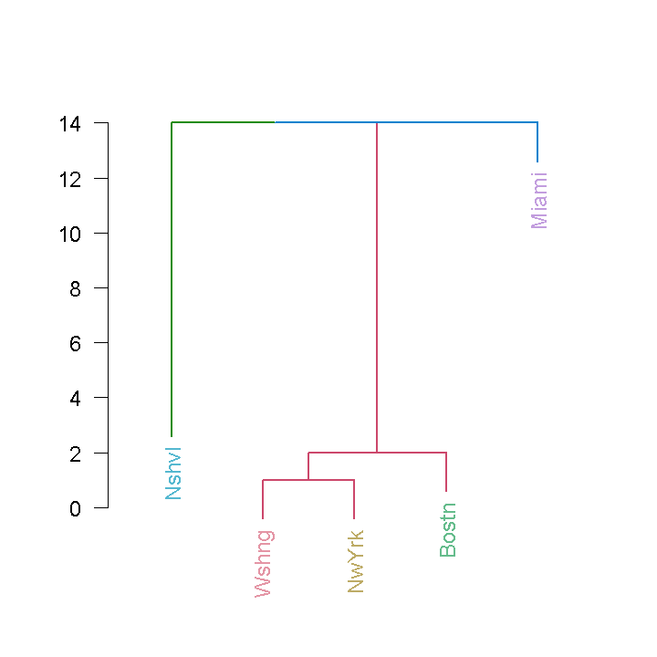
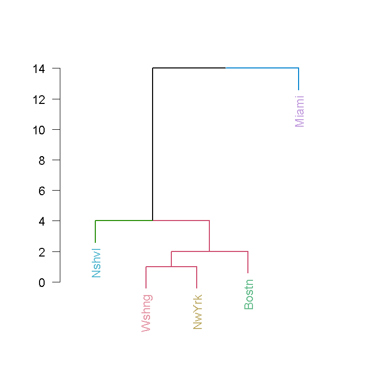

Creating beautiful trees of clusterings with R
==============================================
author: Tal Galili
date: 2013-09-05
transition: none
transition-speed: fast
autosize: false
width: 1940
height: 1200

Boston-useR


Intro to heirarchical clustering in R
================================================================
type: section

## -  hclust objects in R
## -  dendrogram objects in R


hclust objects in R
================================================================
type: sub-section


hclust: precip data-set
================================================================
left: 60%

**precip**: The average amount of rainfall (precipitation) in inches for three US cities in 1975.


**Code:** 


```r
data(precip)
precip_data <- 
   round(precip[c("Boston", "New York", "Nashville")])
DIST <- dist(precip_data, diag=TRUE)
# create an heirarchical clustering object
hc <- hclust(DIST, method = "single") 
```


**Data:** 

```
   Boston  New York Nashville 
       42        40        46 
```


**Matrix of euclidean distances:**


```
          Boston New York Nashville
Boston         0                   
New York       2        0          
Nashville      4        6         0
```


***

**Dendrogram:**


```r
par(cex=1.14, cex.lab = 1.2, lwd = 4,las = 1)
plot(hc, hang = -1) 
abline(h = c(2,4), 
       lty = 2, col = 2, lwd = 2)
```




hclust: k-clustering
================================================================
incremental: false
left: 60%

**R Code**:

Getting the clusters:


```r
cutree(hc, k = 2)
```

```
   Boston  New York Nashville 
        1         1         2 
```

   

```r
cutree(hc, h = 3.5)
```

```
   Boston  New York Nashville 
        1         1         2 
```


***


**Dendrogram:** (with rectangles)


```r
par(cex=1.14, cex.lab = 1.2, lwd = 4,las = 1)
plot(hc, hang = -1) 

abline(h = 3.5, col = 2, lty = 2)
rect.hclust(hc, k = 2, border = 3)
```


```r
# No - xlim didn't fix this...
```


hclust: other clustering algorithms
================================================================


```
1 2 3 5 
1 2 3 5 
```




hclust: pros and cons
================================================================
incremental: false
left: 50%

advantages
----------

- **Diversity in statistical methods:**

"single", "complete", "average", "ward", "mcquitty", "median" or "centroid".


- **Speed:**


```r
DIST <- dist(rnorm(4000))
system.time(hc2 <- hclust(DIST))
```

```
   user  system elapsed 
   1.23    0.03    1.33 
```

```r
system.time(cutree(hc2, k = 4))
```

```
   user  system elapsed 
   0.02    0.00    0.02 
```


***

dis-advantages
--------------

- **Limited flexibility in plotting:**

- **Only binary trees**

- **"Complex" data structure:**
(see "merge")


```r
str(hc)
```

```
List of 7
 $ merge      : int [1:2, 1:2] -1 -3 -2 1
 $ height     : num [1:2] 2 4
 $ order      : int [1:3] 3 1 2
 $ labels     : chr [1:3] "Boston" "New York" "Nashville"
 $ method     : chr "single"
 $ call       : language hclust(d = DIST, method = "single")
 $ dist.method: chr "euclidean"
 - attr(*, "class")= chr "hclust"
```


dendrogram objects in R
================================================================
type: sub-section


hclust -> dendrogram: dendrogram structure
================================================================
left: 70%
incremental: false


```r
data(precip)
precip_data <- 
   round(precip[c("Boston", "New York", "Nashville")])
DIST <- dist(precip_data, diag=TRUE)
# create an heirarchical clustering object
hc <- hclust(DIST, "single") 
#########################
##### hclust to dend ####
#########################
dend <- as.dendrogram(hc)

print(dend)
```

```
'dendrogram' with 2 branches and 3 members total, at height 4 
```

```r
str(dend)
```

```
--[dendrogram w/ 2 branches and 3 members at h = 4]
  |--leaf "Nashville" 
  `--[dendrogram w/ 2 branches and 2 members at h = 2]
     |--leaf "Boston" 
     `--leaf "New York" 
```


***

**Dendrogram:**



hclust -> dendrogram: dendrogram structure
================================================================
left: 70%
incremental: false


```r
str(unclass(dend))
```

```
List of 2
 $ : atomic [1:1] 3
  ..- attr(*, "members")= int 1
  ..- attr(*, "height")= num 0
  ..- attr(*, "label")= chr "Nashville"
  ..- attr(*, "leaf")= logi TRUE
 $ :List of 2
  ..$ : atomic [1:1] 1
  .. ..- attr(*, "label")= chr "Boston"
  .. ..- attr(*, "members")= int 1
  .. ..- attr(*, "height")= num 0
  .. ..- attr(*, "leaf")= logi TRUE
  ..$ : atomic [1:1] 2
  .. ..- attr(*, "label")= chr "New York"
  .. ..- attr(*, "members")= int 1
  .. ..- attr(*, "height")= num 0
  .. ..- attr(*, "leaf")= logi TRUE
  ..- attr(*, "members")= int 2
  ..- attr(*, "midpoint")= num 0.5
  ..- attr(*, "height")= num 2
 - attr(*, "members")= int 3
 - attr(*, "midpoint")= num 0.75
 - attr(*, "height")= num 4
```


***
**Dendrogram:**


dendrogram: what can we do with them? 
================================================================
left: 70%
About 11 things:


```r
as.matrix(methods(class="dendrogram"))
```

```
      [,1]                   
 [1,] "[[.dendrogram"        
 [2,] "as.hclust.dendrogram" 
 [3,] "cophenetic.dendrogram"
 [4,] "cut.dendrogram"       
 [5,] "labels.dendrogram"    
 [6,] "merge.dendrogram"     
 [7,] "plot.dendrogram"      
 [8,] "print.dendrogram"     
 [9,] "reorder.dendrogram"   
[10,] "rev.dendrogram"       
[11,] "str.dendrogram"       
```


***
**Dendrogram:**


dendrogram: Extracting elements
================================================================
left: 70%


**labels**:


```r
labels(dend)
```

```
[1] "Nashville" "Boston"    "New York" 
```


**order.dendrogram**:

```r
order.dendrogram(dend)
```

```
[1] 3 1 2
```

(values for ordering original data to have tree order)


Using **[[**, **str** and **print**:


```r
print(str(dend[[2]]))
```

```
--[dendrogram w/ 2 branches and 2 members at h = 2]
  |--leaf "Boston" 
  `--leaf "New York" 
NULL
```


***
**Dendrogram:**


dendrogram: Tree cutting/merging
================================================================
left: 70%

**cut:**

(like cutree with only h)


```r
cut(dend,h=50)
```

```
$upper
'dendrogram' with 2 branches and 2 members total, at height 4 

$lower
$lower[[1]]
'dendrogram' leaf 'Nashville', at height 0 

$lower[[2]]
'dendrogram' with 2 branches and 2 members total, at height 2 
```


**merge:**


```r
cut_dend <- cut(dend,h=3)$lower
# now let's get our tree back:
merge(cut_dend[[1]], cut_dend[[2]], height = 4)
```

```
'dendrogram' with 2 branches and 3 members total, at height 4 
```


***
**Dendrogram:**


dendrogram: Retreiving (cophenetic) distances
================================================================
left: 70%


```r
ord <- order.dendrogram(dend)
DIST <- dist(precip_data[ord], diag=TRUE)
print(DIST, diag = TRUE)
```

```
          Nashville Boston New York
Nashville         0                
Boston            4      0         
New York          6      2        0
```

```r
coph_dend <- cophenetic(dend)
as.dist(coph_dend, diag = TRUE)
```

```
          Nashville Boston New York
Nashville         0                
Boston            4      0         
New York          4      2        0
```


Notice "Nashville" and "New York" has different distances.

**Cophenetic correlation coefficient:** a measure of how faithfully a dendrogram preserves the pairwise distances between the original unmodeled data points.


```r
round(
   cor(DIST, coph_dend),
   2)
```

```
[1] 0.87
```


***
**Dendrogram:**


dendrogram: Plotting and changing order
================================================================

**plot** and **rev**:


```r
par(mfrow = c(1,2))
plot(dend) # has various options
plot(rev(dend))
```


(reorder == not easy!)

dendrogram: what can we do with them?
================================================================

Plotting options
----------------------------


```r
args(stats:::plot.dendrogram)
```

```
function (x, type = c("rectangle", "triangle"), center = FALSE, 
    edge.root = is.leaf(x) || !is.null(attr(x, "edgetext")), 
    nodePar = NULL, edgePar = list(), leaflab = c("perpendicular", 
        "textlike", "none"), dLeaf = NULL, xlab = "", ylab = "", 
    xaxt = "n", yaxt = "s", horiz = FALSE, frame.plot = FALSE, 
    xlim, ylim, ...) 
NULL
```


dendrogram: Plotting options - example
================================================================


```r
par(mfrow = c(1,2), cex = 2)
plot(dend, main = "default") 
plot(dend, main = "modified",
     type = "t", center = TRUE, horiz = TRUE, 
     nodePar = list(lab.col = 4), 
     edgePar = list(col = 3 , lwd = 3)) 
```


dendrogram: Recursive functions
================================================================
left: 60%


```r
print_height <- function(x) { 
   print(attr(x, "height"))
   }

tmp <- dendrapply(dend,
                  print_height)
```

```
[1] 4
[1] 0
[1] 2
[1] 0
[1] 0
```


***
 


dendrogram: cons and pros
================================================================
incremental: false
left: 50%

dis-advantages
--------------

- **No statistical methods**

- **Terrible Speed**
(recursion in R)


***

advantages
--------------

- **Many methods**
(including as.dendrogram)

- **Flexibility in plotting**

- **Beyond binary trees**

- **"simple" data structure**
(a list of lists with attributes)

-  **Extensively used** in packages:
   -  {latticeExtra}: dendrogramGrob.
   -  {labeltodendro}: colorplot.
   -  {bclust}: bclust.
   -  {ggdendro}: dendro_data.
   -  {Heatplus}: annHeatmap2.
   -  {sparcl}: ColorDendrogram.


{dendextend}: extending dendrograms in R
================================================================
type: section
left: 60%

Credits:
-------------


```
Tal Galili Developer [aut, cre, ctb],
  Gavin Simpson [ctb],
  jefferis [ctb] (imported code from the dendroextras package),
  Marco Gallotta [ctb] (a.k.a: marcog),
  plannapus [ctb],
  Gregory [ctb],
  R core team [ctb] (Infastructure)
```

```
Yoav Benjamini
```


Motivation for {dendextend}
------------------------------

-  Many methods already exists
-  as.dendrogram method for converting hclust and phylo objects
-  Conceptually easy to extend

   
***


dendextend has 89 functions



Accessing/Manipulating dendrogram elements
================================================================
type: sub-section

Data:


```r
data(precip)
precip_data <- 
   round(precip[c("Boston", "New York", "Nashville", "Miami" , "Washington")])
DIST <- dist(precip_data, diag=TRUE)
# create an heirarchical clustering object
hc <- hclust(DIST, "single") 

dend <- rev(as.dendrogram(hc))
t(t(sort(precip_data)))
```

```
           [,1]
Washington   39
New York     40
Boston       42
Nashville    46
Miami        60
```


***

Figure:


```r
par(cex = 2, lwd = 2) 
# notice how it effects the plot!
plot(dend, las = 2)
```


Leaves and branches attributes
================================================================


```r
require(dendextend)
nleaves(dend)
```

```
[1] 5
```

```r
nnodes(dend)
```

```
[1] 9
```

```r
get_nodes_attr(dend, "height")
```

```
[1] 14  4  2  1  0  0  0  0  0
```

```r
get_nodes_attr(dend, "members")
```

```
[1] 5 4 3 2 1 1 1 1 1
```

```r
labels_colors(dend)
```

```
NULL
```


***

Figure:


```r
par(cex = 2, lwd = 2, las = 2) 
# notice how it effects the plot!
plot(dend)
```


Colors - for leaves
================================================================

**Color leaves**:

```r
require(colorspace)
dend2 <- dend
labels(dend2) <- abbreviate(labels(dend2),5)
labels_colors(dend2) <- rainbow_hcl(nleaves(dend2))
```


```r
par(cex = 2, lwd = 2, las = 2) 
plot(dend2)   
```


***

Old figure:


```r
par(cex = 2, lwd = 2, las = 2) 
plot(dend)   
```


Colors - for branches
================================================================
**Color leaves**:

```r
require(colorspace)
dend2 <- dend
labels(dend2) <- abbreviate(labels(dend2),5)
labels_colors(dend2) <- rainbow_hcl(nleaves(dend2))
```


```r
par(cex = 2, lwd = 2, las = 2) 
plot(dend2)   
```


***

**Color branches**:

```r
dend3 <- color_branches(dend2, k=3)
par(cex = 2, lwd = 2, las = 2) 
plot(dend3)   
abline(h=3, col = 3, lty = 2)
```




Color locations - for leaves and branches
================================================================

Color locations


```r

data.frame(
node_label=get_nodes_attr(dend, "label"),
edgePar_col=unlist(get_nodes_attr(dend, "edgePar")),
label_col=unlist(get_nodes_attr(dend, "nodePar")) )
```

```
  node_label edgePar_col label_col
1       <NA>          NA        NA
2       <NA>          NA        NA
3       <NA>          NA        NA
4       <NA>          NA        NA
5 Washington          NA        NA
6   New York          NA        NA
7     Boston          NA        NA
8  Nashville          NA        NA
9      Miami          NA        NA
```

```r
# NA's are for the root and the left branch
```


***

**Color branches and leaves**:

```r
par(cex = 2, lwd = 2, las = 2) 
plot(dend3)   

abline(h=3, col = 3, lty = 2)
```


Hanging
========================================


```r
dend4 <- hang.dendrogram(dend3)

par(cex = 2, lwd = 2, las = 2)
plot(dend4)   
```




***

**Color branches and leaves**:

```r
par(cex = 2, lwd = 2, las = 2) 
plot(dend3)   

abline(h=3, col = 3, lty = 2)
```


Rotating
========================================


```r


par(cex = 2, lwd = 2, las = 2)
plot(dend4)   
```


***


```r


dend5 <- rotate(dend4, c(4, 1:3, 5))
par(cex = 2, lwd = 2, las = 2)
plot(dend5)   
```


Unbranching 
========================================


```r
dend6 <- unbranch(dend5)

par(cex = 2, lwd = 2, las = 2) 
plot(dend6) 
```




```r
# as.hclust(dend) is not longer possible...
```


***


```r


dend5 <- rotate(dend4, c(4, 1:3, 5))
par(cex = 2, lwd = 2, las = 2)
plot(dend5)   
```




Trimming
========================================


```r
dend6 <- unbranch(dend5)

par(cex = 2, lwd = 2, las = 2) 
plot(dend6) 
```


***


```r
dend7 <- trim(dend6, c("Wshng", "NwYrk")) 

par(cex = 2, lwd = 2, las = 2) 
plot(dend7) 
```


k-clustering: cutree
========================================

Three clusters:


```r
cutree(dend7 , k=3)
```

```
Bostn Nshvl Miami 
    1     2     3 
```

```r
cutree(dend7 , k=3,order_clusters_as_data=FALSE)
```

```
Nshvl Bostn Miami 
    1     2     3 
```

```r
args(cutree.dendrogram)
```

```
function (tree, k = NULL, h = NULL, dend_heights_per_k = NULL, 
    use_labels_not_values = TRUE, order_clusters_as_data = TRUE, 
    sort_cluster_numbers = TRUE, warn = TRUE, try_cutree_hclust = TRUE, 
    ...) 
NULL
```


***


```r


par(cex = 2, lwd = 2, las = 2) 
plot(dend7)  
```


Iris dataset- a quick example
========================================
left: 50%

**Iris dataset:** - 150 items, 50 from each of three species of Iris (Iris setosa, Iris virginica and Iris versicolor). Four features were measured from each sample: the length and the width of the sepals and petals, in centimetres.


***


Tanglegram plot: visually comparing two trees
================================================================
type: sub-section


Statistical inference on the similarity of two trees
================================================================
type: sub-section


