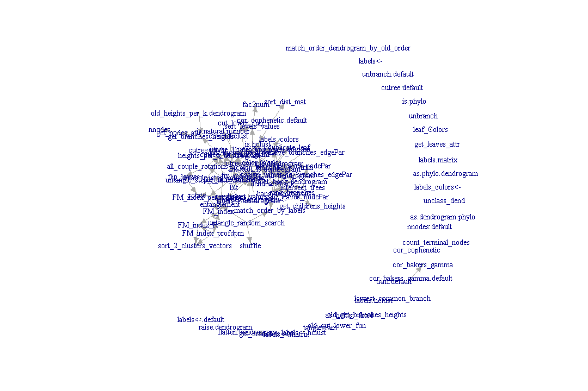
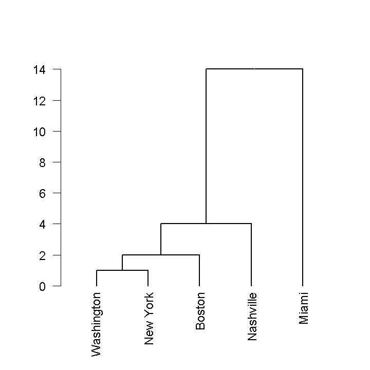
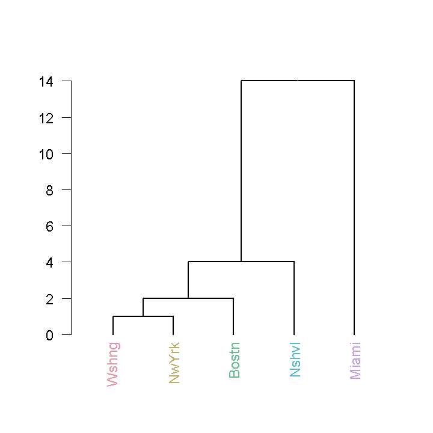
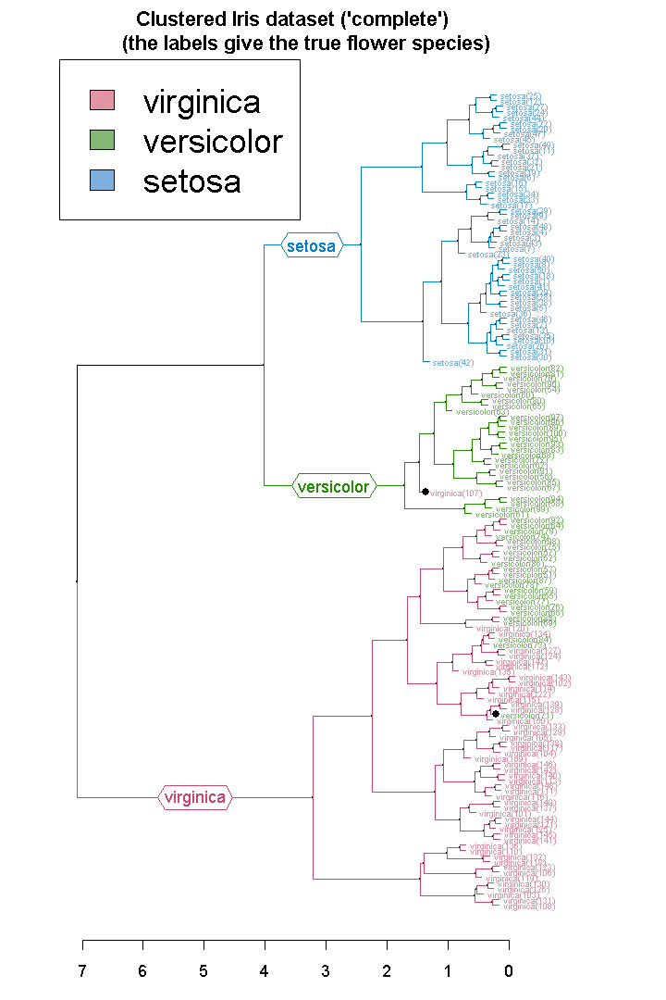
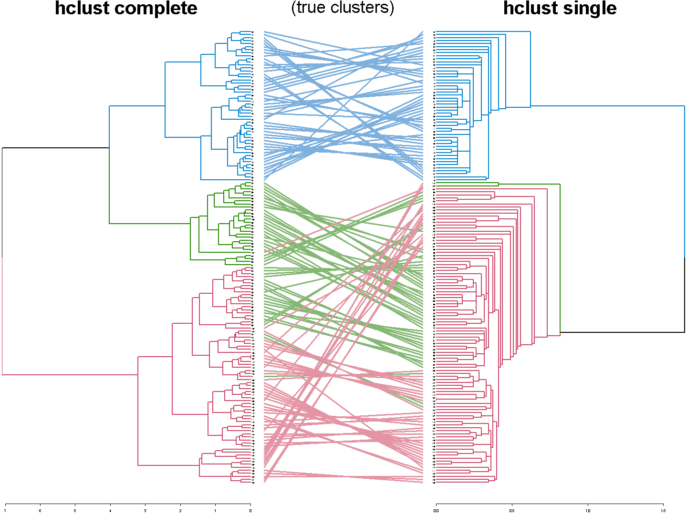
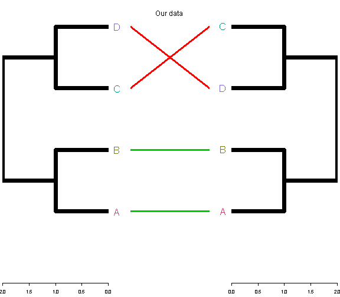
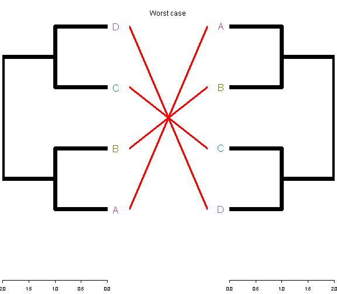
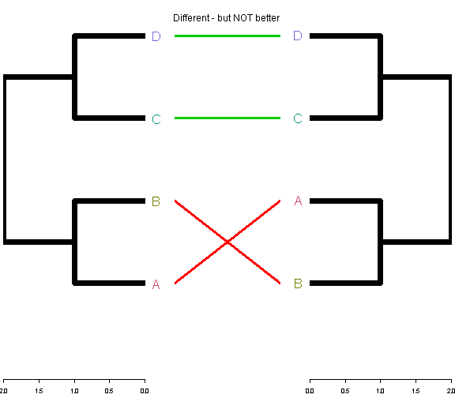
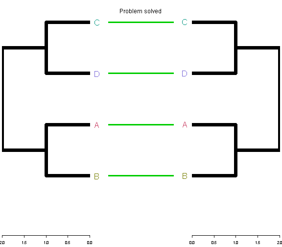
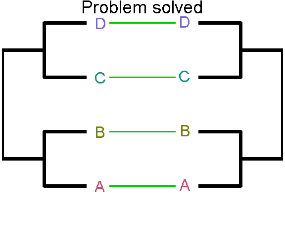

Creating beautiful trees of clusterings with R - dendextend
==============================================
author: Tal Galili
date: 2013-09-05
transition: none
transition-speed: fast
autosize: false
width: 1940
height: 1200

Boston-useR


dendrogram: cons and pros
================================================================
incremental: false
left: 50%

dis-advantages
--------------

- **No statistical methods**

- **Terrible Speed**
(recursion in R)


***

advantages
--------------

- **Many methods**
(including as.dendrogram)

- **Flexibility in plotting**

- **Beyond binary trees**

- **"simple" data structure**
(a list of lists with attributes)

-  **Extensively used** in packages:
   -  {latticeExtra}: dendrogramGrob.
   -  {labeltodendro}: colorplot.
   -  {bclust}: bclust.
   -  {ggdendro}: dendro_data.
   -  {Heatplus}: annHeatmap2.
   -  {sparcl}: ColorDendrogram.


{dendextend}: extending dendrograms in R
================================================================
type: section
left: 60%

Credits:
-------------


```
Tal Galili Developer [aut, cre, ctb],
  Gavin Simpson [ctb],
  jefferis [ctb] (imported code from the dendroextras package),
  Marco Gallotta [ctb] (a.k.a: marcog),
  plannapus [ctb],
  Gregory [ctb],
  R core team [ctb] (Infastructure)
```

```
Yoav Benjamini
```


Motivation for {dendextend}
------------------------------

-  Many methods already exists
-  as.dendrogram method for converting hclust and phylo objects
-  Conceptually easy to extend

   
***


dendextend has 89 functions



Accessing/Manipulating dendrogram elements
================================================================
type: sub-section

Data:


```r
data(precip)
precip_data <- 
   round(precip[c("Boston", "New York", "Nashville", "Miami" , "Washington")])
DIST <- dist(precip_data, diag=TRUE)
# create an heirarchical clustering object
hc <- hclust(DIST, "single") 

dend <- rev(as.dendrogram(hc))
t(t(sort(precip_data)))
```

```
           [,1]
Washington   39
New York     40
Boston       42
Nashville    46
Miami        60
```


***

Figure:


```r
par(cex = 2, lwd = 2) 
# notice how it effects the plot!
plot(dend, las = 2)
```


Leaves and branches attributes
================================================================


```r
require(dendextend)
nleaves(dend)
```

```
[1] 5
```

```r
nnodes(dend)
```

```
[1] 9
```

```r
get_nodes_attr(dend, "height")
```

```
[1] 14  4  2  1  0  0  0  0  0
```

```r
get_nodes_attr(dend, "members")
```

```
[1] 5 4 3 2 1 1 1 1 1
```

```r
labels_colors(dend)
```

```
NULL
```


***

Figure:


```r
par(cex = 2, lwd = 2, las = 2) 
# notice how it effects the plot!
plot(dend)
```


Coloring: leaves
================================================================

**Color leaves**:

```r
require(colorspace)
dend2 <- dend
labels(dend2) <- abbreviate(labels(dend2),5)
labels_colors(dend2) <- rainbow_hcl(nleaves(dend2))
```


```r
par(cex = 2, lwd = 2, las = 2) 
plot(dend2)   
```


***

Old figure:


```r
par(cex = 2, lwd = 2, las = 2) 
plot(dend)   
```




Coloring: branches
================================================================
**Color leaves**:

```r
require(colorspace)
dend2 <- dend
labels(dend2) <- abbreviate(labels(dend2),5)
labels_colors(dend2) <- rainbow_hcl(nleaves(dend2))
```


```r
par(cex = 2, lwd = 2, las = 2) 
plot(dend2)   
```




***

**Color branches**:

```r
dend3 <- color_branches(dend2, k=3)
par(cex = 2, lwd = 2, las = 2) 
plot(dend3)   
abline(h=3, col = 3, lty = 2)
```


Color locations - for leaves and branches
================================================================

Color locations


```r

data.frame(
node_label=get_nodes_attr(dend, "label"),
edgePar_col=unlist(get_nodes_attr(dend, "edgePar")),
label_col=unlist(get_nodes_attr(dend, "nodePar")) )
```

```
  node_label edgePar_col label_col
1       <NA>          NA        NA
2       <NA>          NA        NA
3       <NA>          NA        NA
4       <NA>          NA        NA
5 Washington          NA        NA
6   New York          NA        NA
7     Boston          NA        NA
8  Nashville          NA        NA
9      Miami          NA        NA
```

```r
# NA's are for the root and the left branch
```


(relatively simple since we only have one relevant parameter in the object: color)

***

**Color branches and leaves**:

```r
par(cex = 2, lwd = 2, las = 2) 
plot(dend3)   

abline(h=3, col = 3, lty = 2)
```


Hanging
========================================


```r
dend4 <- hang.dendrogram(dend3)

par(cex = 2, lwd = 2, las = 2)
plot(dend4)   
```


***

**Color branches and leaves**:

```r
par(cex = 2, lwd = 2, las = 2) 
plot(dend3)   

abline(h=3, col = 3, lty = 2)
```


Rotating
========================================


```r
dend4 <- hang.dendrogram(dend3)

par(cex = 2, lwd = 2, las = 2)
plot(dend4)   
```


***


```r
dend5 <- rotate(dend4, c(4, 1:3, 5))
par(cex = 2, lwd = 2, las = 2)
plot(dend5)   
```


(may also use labels' names)


Unbranching 
========================================


```r
dend6 <- unbranch(dend5)

par(cex = 2, lwd = 2, las = 2) 
plot(dend6) 
```


```r
# as.hclust(dend) is not longer possible...
```


***


```r
dend5 <- rotate(dend4, c(4, 1:3, 5))
par(cex = 2, lwd = 2, las = 2)
plot(dend5)   
```


Trimming
========================================


```r
dend6 <- unbranch(dend5)

par(cex = 2, lwd = 2, las = 2) 
plot(dend6) 
```


***


```r
dend7 <- prune(dend6, c("Wshng", "NwYrk")) 

par(cex = 2, lwd = 2, las = 2) 
plot(dend7) 
```


k-clustering: cutree
========================================

Three clusters:


```r
cutree(dend7 , k=3)
```

```
Bostn Nshvl Miami 
    1     2     3 
```

```r
cutree(dend7 , k=3,order_clusters_as_data=FALSE)
```

```
Nshvl Bostn Miami 
    1     2     3 
```

```r
args(cutree.dendrogram)
```

```
function (tree, k = NULL, h = NULL, dend_heights_per_k = NULL, 
    use_labels_not_values = TRUE, order_clusters_as_data = TRUE, 
    sort_cluster_numbers = TRUE, warn = TRUE, try_cutree_hclust = TRUE, 
    ...) 
NULL
```


***


```r
dend7 <- prune(dend6, c("Wshng", "NwYrk")) 

par(cex = 2, lwd = 2, las = 2) 
plot(dend7) 
```


Iris dataset- a quick example
========================================
left: 50%

**Iris dataset:** - 150 items, 50 from each of three species of Iris (Iris setosa, Iris virginica and Iris versicolor). Four features were measured from each sample: the length and the width of the sepals and petals, in centimetres.


***




Tanglegram plot: visually comparing two trees
================================================================
type: sub-section




Tanglegram plot has MANY options
===========================================


```r
args(dendextend:::tanglegram.dendrogram)
```

```
function (tree1, tree2, sort = FALSE, color_lines = "darkgrey", 
    lwd = 3.5, edge.lwd = NULL, columns_width = c(5, 3, 5), margin_top = 3, 
    margin_bottom = 2.5, margin_inner = 3, margin_outer = 0.5, 
    left_dendo_mar = c(margin_bottom, margin_outer, margin_top, 
        margin_inner), right_dendo_mar = c(margin_bottom, margin_inner, 
        margin_top, margin_outer), intersecting = TRUE, dLeaf = NULL, 
    dLeaf_left = dLeaf, dLeaf_right = dLeaf, axes = TRUE, type = "r", 
    lab.cex = NULL, remove_nodePar = FALSE, main = "", main_left = "", 
    main_right = "", k_labels = NULL, k_branches = NULL, rank_branches = FALSE, 
    hang = FALSE, match_order_by_labels = TRUE, cex_main = 3, 
    cex_main_left = cex_main, cex_main_right = cex_main, ...) 
NULL
```

When producing many consequtive plots - it is better to use the dendrograms after adjustment (as returned by "tanglegram").


Tanglegram plot: a simple example
=====================================================
left: 50%

**Simple Data**:


```r
DIST <- dist(c(1,2,4,5), diag=TRUE)
# create an heirarchical clustering object
hc1 <- hclust(DIST, "single") 
dend1 <- as.dendrogram(hc1)
dend1 <- color_labels(dend1)
labels(dend1) <- LETTERS[1:4]
dend2 <- rotate(dend1, order=c(1,2,4,3))
dend2_worst <- rev(dend1) # in the code it is a bit different
```


**Measuring entanglement**

- Often measured as the number of line-crossings.
- We measure it as the sum of the L-norm difference between the ranks of labels of the two trees (devided by the worst case).

In our case:


```r
entanglement(dend1,dend2, L = 1.5)
```

```
[1] 0.161
```


***

Tanglegram plots:


```r
tanglegram(dend1, dend2, 
           main = "Our data",
           color_lines = c(3,3,2,2), 
           lab.cex = 4, edge.lwd = 7,
           margin_inner= 5, margin_bottom = 0, 
           axes = FALSE)
```




(no need for axes in this case)

Measuring entanglement (step-by-step): L=1.5
=====================================================
left: 50%


```r
abs_rank_diff <- abs(c(1:4)-c(1,2,4,3))
abs_rank_diff
```

```
[1] 0 0 1 1
```

```r
L<-1.5
L_norm <- abs_rank_diff^L
sum_L_norm <- sum(L_norm)
worst_case <- sum((abs(c(1:4)-c(4:1)))^L)
sum_L_norm
```

```
[1] 2
```

```r
worst_case
```

```
[1] 12.4
```

```r
sum_L_norm / worst_case
```

```
[1] 0.161
```


```r
entanglement(dend1,dend2)
```

```
[1] 0.161
```


***

Tanglegram plots:





Measuring entanglement (step-by-step): L=0
=====================================================
left: 50%

When using L=0, it is (mostly) the percent of non-streight lines:


```r
abs_rank_diff <- abs(c(1:4)-c(1,2,4,3))
abs_rank_diff
```

```
[1] 0 0 1 1
```

```r
L<-0
L_norm <- abs_rank_diff^L
sum_L_norm <- sum(L_norm)
worst_case <- sum((abs(c(1:4)-c(4:1)))^L)
sum_L_norm
```

```
[1] 4
```

```r
worst_case
```

```
[1] 4
```

```r
sum_L_norm / worst_case
```

```
[1] 1
```


```r
entanglement(dend1,dend2, L = 0)
```

```
[1] 0.5
```


***

Tanglegram plots:


Untangaling tanglegrams: random flip (once)
=====================================================
left: 50%

Optimizing rotation is an NP-hard problem!

Let us do a naive **random search** over one shuffle of the right trees:


```r

set.seed(1112) # always set this first!
dend2_shuffle <- shuffle(dend2)
tanglegram(dend1, dend2_shuffle, lab.cex = 4, edge.lwd = 7, color_lines = c(2,2,3,3), main = "Different - but NOT better",
                      margin_inner= 5, margin_bottom = 0, 
           axes = FALSE)
```




***

Tanglegram plots:


Untangaling tanglegrams: random flip (many times)
=====================================================
left: 50%

Naive **random search** over MANY shuffles of BOTH trees:


```r

set.seed(65168)
dend12 <- untangle_random_search(dend1, dend2, R=10)
tanglegram(dend12[[1]] , dend12[[2]], lab.cex = 4, edge.lwd = 7, color_lines = rep(3,4), main = "Problem solved",
                      margin_inner= 5, margin_bottom = 0, 
           axes = FALSE)
```




(notice the new leaves order)

***

Tanglegram plots:


Untangaling tanglegrams: forward step (1 side)
=====================================================
left: 50%

Pick one tree - and check rotations for improvement from root to leaves:


```r
# set.seed(65168) # doesn't matter
dend2_corrected <- untangle_step_rotate_1side(dend2, dend1)
tanglegram(dend1 , dend2_corrected, lab.cex = 4, edge.lwd = 7, color_lines = rep(3,4), main = "Problem solved",
                      margin_inner= 5, margin_bottom = 0, 
           axes = FALSE)
```




The same exists for BOTH sides using: "untangle_step_rotate_1side"

(notice the leaves' locations of the first tree did NOT change)

***

Tanglegram plots:


