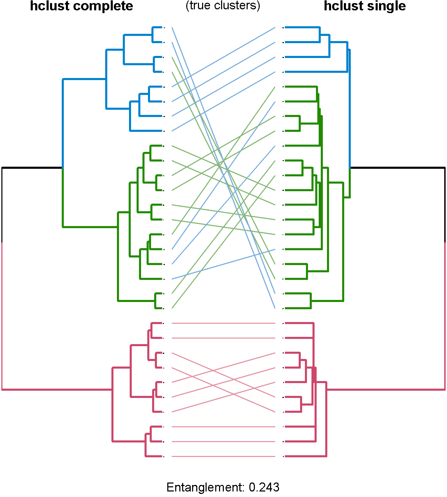
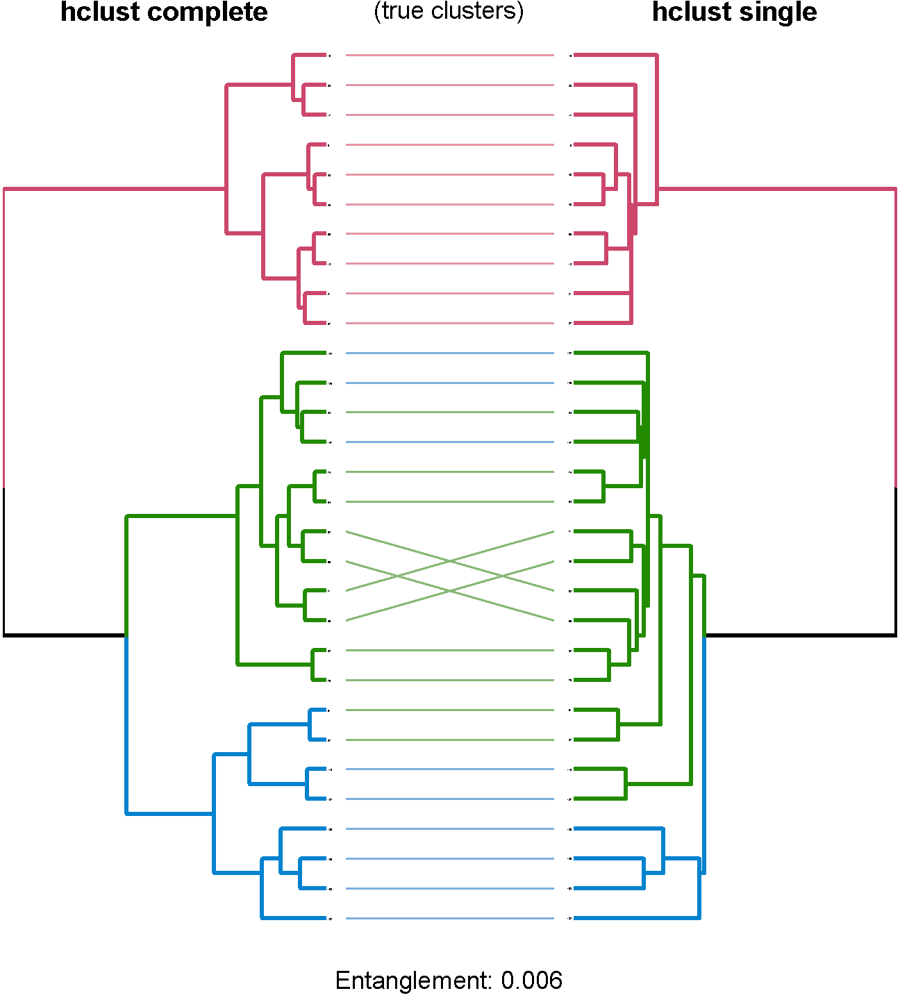
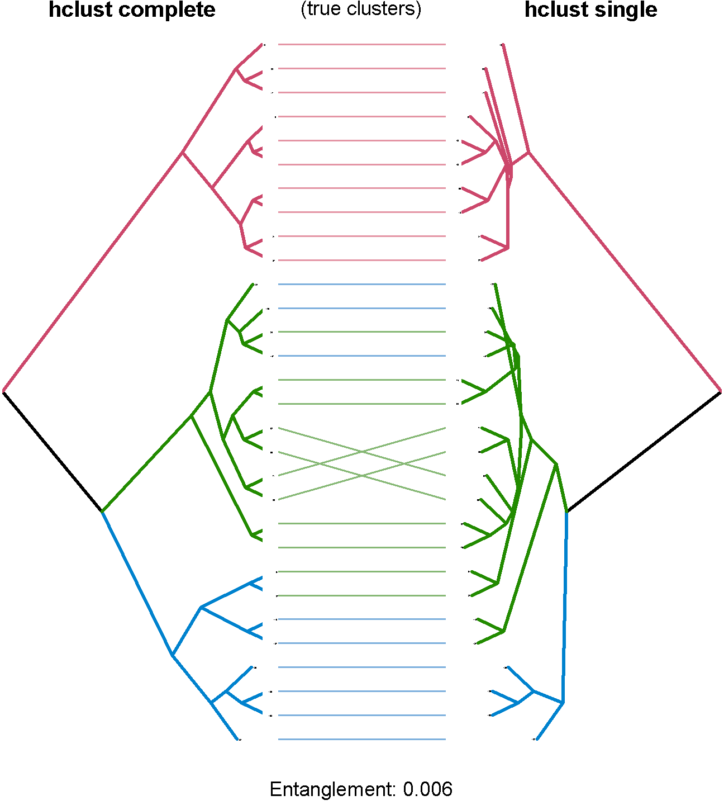

Creating beautiful trees of clusterings with R - untangle Iris example
==============================================
author: Tal Galili
date: 2013-09-05
transition: none
transition-speed: fast
autosize: false
width: 1940
height: 1200

Boston-useR


Tanglegram plot - Iris example: first attempt
================================================================

(a sample of 30)


```r
set.seed(85945987)
ss <- sample(1:150, 30)
hc1 <- hclust(dist(iris[ss,-5]), "com")
hc2 <- hclust(dist(iris[ss,-5]), "single")
dend1 <- as.dendrogram(hc1)
dend2 <- as.dendrogram(hc2)
```


```r
require(colorspace)
lines_col_true <- rainbow_hcl(3)[sort_levels_values(
      as.numeric(iris[ss,5])[order.dendrogram(dend1)]
   )]
dend12 <- tanglegram(dend1 , dend2, 
           cex_main=3,
           cex_main_left=5,
           cex_main_right=5,
           color_lines=lines_col_true,
           main_left= "hclust complete", main_right="hclust single", main = "(true clusters)",
           lab.cex = .5, edge.lwd = 6, margin_inner= 3, 
           type = "r", center = TRUE, k_branches = 3, axes = FALSE, 
   sub = paste("Entanglement:", 
               round(entanglement(dend1 , dend2),3)),
           )
```


***




Tanglegram plot - Iris example: random search
================================================================


```r
set.seed(2355)
dend12_rotate <- untangle_random_search(
   dend12[[1]],
   dend12[[2]], 
   R= 100  )
dend12 <- dend12_rotate
```


```r
lines_col_true <- rev(rainbow_hcl(3))[sort_levels_values(
      as.numeric(iris[ss,5])
      [order.dendrogram(dend12[[1]])]
   )]
dend12 <- tanglegram(dend12[[1]] , dend12[[2]], 
           cex_main=3,
           cex_main_left=5,
           cex_main_right=5,
           color_lines=lines_col_true,
           main_left= "hclust complete", main_right="hclust single", main = "(true clusters)",axes = FALSE,
           lab.cex = .5, edge.lwd = 6, margin_inner= 3, 
           type = "r", center = TRUE,
   sub = paste("Entanglement:", 
               round(entanglement(dend12[[1]] , dend12[[2]]),3)),
           )
```


***


Tanglegram plot - Iris example: forward step-wise rotations
================================================================


```r
# This can be slow!
dend12_rotate <- untangle_step_rotate_2side(
   dend12[[1]],
   dend12[[2]] )
```

```
We ran untangle  1  times
```

```r
dend12 <- dend12_rotate
```


```r
lines_col_true <- rev(rainbow_hcl(3))[sort_levels_values(
      as.numeric(iris[ss,5])
      [order.dendrogram(dend12[[1]])]
   )]
dend12 <- tanglegram(dend12[[1]] , dend12[[2]], axes = FALSE,
           cex_main=3,
           cex_main_left=5,
           cex_main_right=5,
           color_lines=lines_col_true,
           main_left= "hclust complete", main_right="hclust single", main = "(true clusters)",
           lab.cex = .5, edge.lwd = 6, margin_inner= 3, 
           type = "r", center = TRUE,                     
   sub = paste("Entanglement:", 
               round(entanglement(dend12[[1]] , dend12[[2]]),3)),
           )
```


***




Tanglegram plot - Iris example: notcing differences - hanging the triangle tree
================================================================


```r
lines_col_true <- rev(rainbow_hcl(3))[sort_levels_values(
      as.numeric(iris[ss,5])
      [order.dendrogram(dend12[[1]])]
   )]
dend12 <- tanglegram(dend12[[1]] , dend12[[2]], 
           cex_main=3,
           cex_main_left=5,
           cex_main_right=5,
           color_lines=lines_col_true,
           main_left= "hclust complete", main_right="hclust single", main = "(true clusters)",axes = FALSE,
           lab.cex = .5, edge.lwd = 6, margin_inner= 3, 
           type = "t", center = TRUE,                     
   sub = paste("Entanglement:", 
               round(entanglement(dend12[[1]] , dend12[[2]]),3)),hang=TRUE,
           )
```


***




