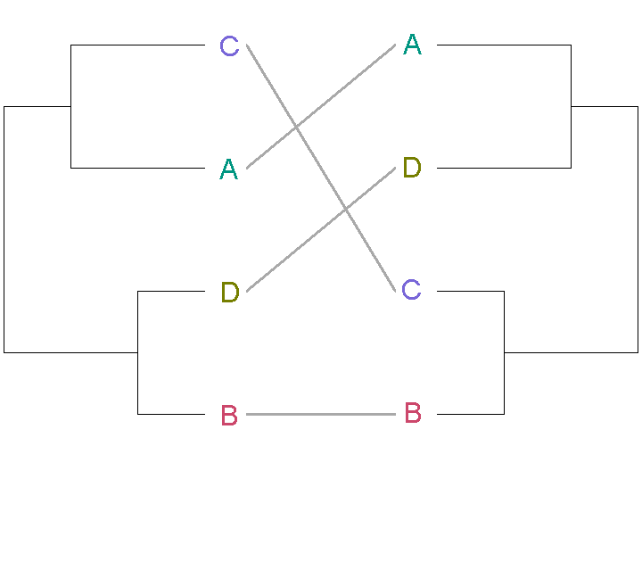
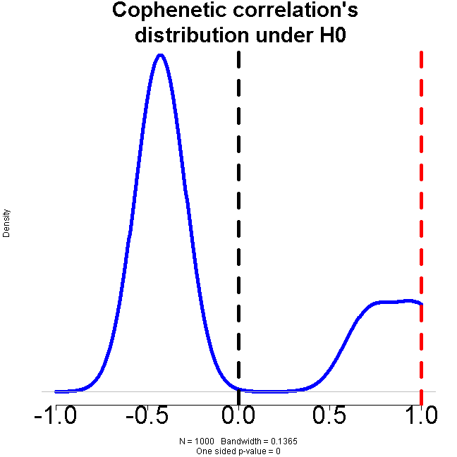
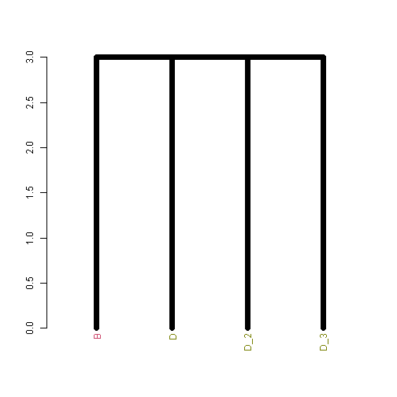
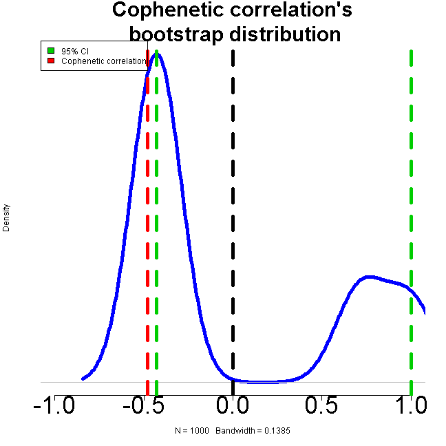

Creating beautiful trees of clusterings with R - statistically comparing trees
==============================================
author: Tal Galili
date: 2013-09-05
transition: none
transition-speed: fast
autosize: false
width: 1940
height: 1200

Boston-useR


dendrogram: Retreiving (cophenetic) distances
================================================================
left: 50%


```r
print(DIST, diag = TRUE)
```

```
  A B C D
A 0      
B 3 0    
C 2 4 0  
D 4 1 4 0
```

```r
coph_dend1 <- cophenetic(dend1) 
as.dist(coph_dend1, diag = TRUE)
```

```
  B D A C
B 0      
D 1 0    
A 3 3 0  
C 3 3 2 0
```


**Cophenetic correlation coefficient:** a measure of how faithfully a dendrogram preserves the pairwise distances between the original unmodeled data points. (in our case - not so good)


```r
round(   cor(DIST, coph_dend1),   2) 
```

```
[1] -0.19
```


***
**Dendrogram:**


cophenetic correlation coefficient between trees
================================================================
left: 50%

This is agnostic to the rotation of the trees.

Wrong way (due to label order)

```r
coph_dend1 <- cophenetic(dend1) 
coph_dend2 <- cophenetic(dend2) 
round(   cor(coph_dend1, coph_dend2),   2) 
```

```
[1] 1
```

```r
labels(coph_dend1)
```

```
     [,1] [,2]
[1,] "B"  "A" 
[2,] "D"  "C" 
```

```r
labels(coph_dend2)
```

```
     [,1] [,2]
[1,] "A"  "B" 
[2,] "D"  "C" 
```


***


DOES work:


```r
cor_cophenetic(dend1, dend2)
```

```
[1] -0.429
```

```r
cor_cophenetic(dend1, dend2, method = "spearman")
```

```
[1] -0.48
```


**Tanglegram:**



Similarity of a tree to itself: a permutation test
===============================================


```r
the_cor <- cor_cophenetic(dend1, dend1)
the_cor
```

```
[1] 1
```

```r
R <- 1000
cor_cophenetic_results <- numeric(R)
dend_mixed <- dend1
for(i in 1:R) {
   dend_mixed <- sample.dendrogram(dend1, replace = FALSE)
   cor_cophenetic_results[i] <- cor_cophenetic(dend1, dend_mixed)
}
```


"sample.dendrogram" can return the same tree but with permutated labels:


```r
labels(dend1)
```

```
[1] "B" "D" "A" "C"
```

```r
labels(sample.dendrogram(dend1,replace=FALSE))
```

```
[1] "A" "C" "D" "B"
```


***


```r
par(cex.axis=3, cex.main = 2.5)
plot(density(cor_cophenetic_results,from=-1, to=1),
     main = "Cophenetic correlation's \n distribution under H0",
     lwd = 5, col = 4, axes = FALSE,
     xlim = c(-1,1))
axis(1)
abline(v = 0, lty = 2, lwd = 5)
abline(v = the_cor, lty = 2, col = 2, lwd = 5)
title(sub = paste("One sided p-value =",  round(sum(the_cor < cor_cophenetic_results)/ R, 4)))
```




Similarity of a tree to another: a bootstrap confidence-interval
===============================================


```r
the_cor <- cor_cophenetic(dend1, dend2)
the_cor
```

```
[1] -0.429
```

```r
set.seed(23525)
R <- 100
cor_cophenetic_results <- numeric(R)
for(i in 1:R) {
   dend2_mixed <- sample.dendrogram(dend2, replace = TRUE)
   cor_cophenetic_results[i] <- cor_cophenetic(dend1, dend2_mixed)
}
```


"sample.dendrogram" can return a non-parametric bootstrap sampled tree:





***


```
  2.5%  97.5% 
-0.429  1.000 
```




(Note the no-variance problem with small trees.)
